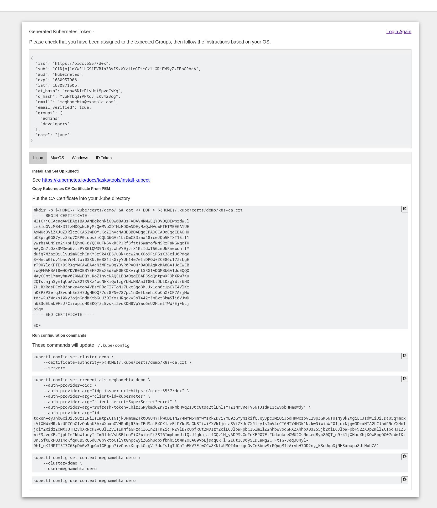

## BYO AUTHN

Follow this guide to set up authentication to K8s clusters using LDAP backend. Components used - 

- `dex` used as OIDC provider 
- `OpenLDAP` for user management and source of truth for authentication 
- Either of `kubelogin` or `dex-k8s-authenticator` for getting token from OIDC provider after succesful authentication. This token will be used to access k8s API server. 

## Sources

- [Gloo: External auth with Dex example](https://docs.solo.io/gloo-gateway/2.1.x/observability/dashboard/auth/dex/)
- [Kubernetes Authentication and Authorization through Dex & LDAP and RBAC rules](https://medium.com/trendyol-tech/kubernetes-authentication-and-authorization-through-dex-ldap-and-rbac-rules-c2e03111b408)
- [Kubelogin Gtihub: Kubernetes OIDC authentication setup with kubelogin](https://github.com/int128/kubelogin/blob/master/docs/setup.md)
- [Dex Github: LDAP setup for dex](https://github.com/dexidp/dex/tree/master/examples/ldap)
- [Dex documentation: Authentication Through LDAP](https://dexidp.io/docs/connectors/ldap/#overview)

## Steps 

- Generate certs in `./ssl`

      ./01_gencerts.sh 

- Start `kind` cluster, LDAP server and dex container - in that order:

      ./kind.sh start
      ./02_ldap-start.sh
      ./03_dex-start.sh # make sure dex.yaml is correct

- Deploy `dex-k8s-authenticator`
  
      ./auth_dex_k8s_authenticator.sh

- In browser, go to [http://dex-k8s-authenticator.127.0.0.1.nip.io/](http://dex-k8s-authenticator.127.0.0.1.nip.io/). Complete the authentication process (refer `ldap/config-ldap.ldif` for example users). It should show page like below on successful completion - 

  

> NOTE: `dex-k8s-authenticator` seems a better alternative than `kubelogin` at the moment, as it readily presents data to be copy-pasted as part of kube-config setup. It also supports multi-cluster configuration (to be evaluated). It reduces work for cluster admins in managing and monitoring whether configuration is correct or not for every user. 

## Cleanup

- Destroy the setup
  
      ./cleanup.sh